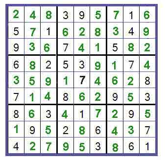
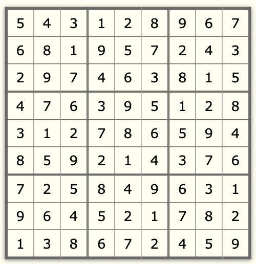
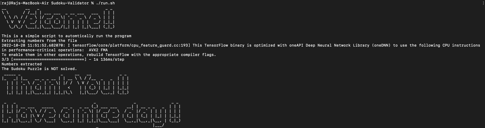

# Sudoku Validator
This project was made for Opearting System Lab project assignment. Fistly, the image is taken as input and numbers are extracted from the image using OCR (Optical Charaacter Recognition) model. The array of numbers are used to validate the sudoku solution. The project uses Tensorflow, OpenCV and Pthreads.

## Dependencies
 - OpenCV
 - Tensorflow
 - Imutils
 - Skimage

## How to run
Clone this repository in folder.
```
git clone https://github.com/rajshah2202/Sudoku-Validator.git
```

Run the run.sh file.
```
./run.sh
```

## Sample Output
Correct Input



Correct Output


Incorrect Input



Incorrect Output
